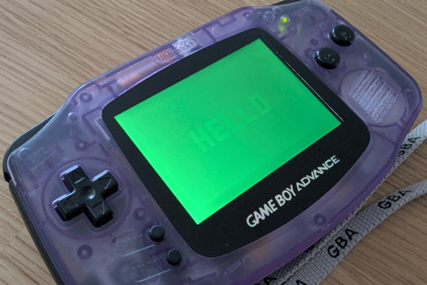

# Green Low Bit (`grn_lo`)

The GBA colour word is often described as 15-bit colour (`R5G5B5`), but bit 15 is not always inert.

## What bit 15 is

```text
Bit:  15      14-10  9-5    4-0
      grn_lo  Blue   Green  Red
```

`grn_lo` is the low bit of an internal 6-bit green path used by colour special effects.

- Without blending effects, `grn_lo` is not visibly distinguishable.
- With brighten/darken/alpha effects enabled, the hardware pipeline can use that extra green precision.
- Some emulators still treat bit 15 as unused, so they render colours as if `grn_lo` does not exist.

## Demo: hidden text using `grn_lo`

This demo draws two colours that differ only by bit 15, then enables brightness increase. On hardware, the hidden text becomes visible; on many emulators, it stays flat/invisible.

```cpp
{{#include ../../demos/demo_green_lo.cpp:4:}}
```

## Comparison screenshots

| Platform | Result | Screenshot |
|----------|--------|------------|
| mGBA (0.11-8996-6a99e17f5) | Text is invisible |  |
| Analogue Pocket (FPGA) | Text is faintly visible |  |
| Real GBA hardware | Text is visible |  |

## Practical guidance

- For normal palette authoring, treat colours as 15-bit.
- If you rely on hardware colour effects and exact output parity, test on real hardware (or FPGA implementations that model this behaviour).
- Keep this behaviour in mind when debugging "looks different on emulator vs hardware" reports.
