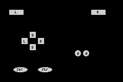

# Key Input

The GBA has 10 buttons: A, B, L, R, Start, Select, and the 4-direction D-pad.

`gba::keypad` gives you:

- level checks (`held`)
- edge checks (`pressed`, `released`)
- axis helpers (`xaxis`, `i_xaxis`, `yaxis`, `i_yaxis`, `lraxis`, `i_lraxis`)
- a predefined combo constant named `gba::reset_combo`

## Reading keys

```cpp
#include <gba/keyinput>
#include <gba/peripherals>

gba::keypad keys;

// In your game loop:
for (;;) {
    gba::VBlankIntrWait();
    keys = gba::reg_keyinput;  // One sample per frame

    if (keys.held(gba::key_a)) {
        // A is currently held down
    }

    if (keys.pressed(gba::key_b)) {
        // B was just pressed this frame (edge detection)
    }

    if (keys.released(gba::key_start)) {
        // Start was just released this frame
    }
}
```

## Frame update contract

`gba::keypad` stores previous and current state internally. Each assignment from `gba::reg_keyinput` updates that state (normally once per frame). This is what powers `pressed()` and `released()`.

Recommended pattern: call `keys = gba::reg_keyinput;` exactly once per game frame (usually right before game state needs to be updated).

If you sample multiple times in the same frame, edge checks can appear inconsistent because you advanced the internal history more than once.

The keypad hardware register itself is active-low (0 means pressed), but `gba::keypad` normalizes this so `held(key)` reads naturally.

## Practical patterns

```cpp
// One-shot action: only fires on the transition frame.
if (keys.pressed(gba::key_a)) {
    jump();
}

// Release-triggered action: useful for menus and drag/release interactions.
if (keys.released(gba::key_b)) {
    close_menu();
}
```

## D-pad axes

For movement, use the axis helpers. `yaxis()` uses the mathematical convention where up is positive:

```cpp
int dx = keys.xaxis();  // -1 (left), 0, or 1 (right)
int dy = keys.yaxis();  // -1 (down), 0, or 1 (up)
```

These return a tri-state value based on the D-pad. If both left and right are held simultaneously, they cancel out to 0.

### Inverted axes

The inverted variants flip the sign. `i_xaxis()` is useful when your camera or gameplay logic expects right-negative coordinates, and `i_yaxis()` matches screen coordinates where Y increases downward:

```cpp
int dx = keys.i_xaxis();  // -1 (right), 0, or 1 (left)
int dy = keys.i_yaxis();  // -1 (up), 0, or 1 (down)

player_x += dx;
player_y += dy;
```

For most gameplay movement, `i_yaxis()` is the convenient choice because screen-space Y grows downward.

### Shoulder axis

The L and R buttons can also be read as an axis:

```cpp
int lr = keys.lraxis();    // -1 (L), 0, or 1 (R)
int ilr = keys.i_lraxis(); // -1 (R), 0, or 1 (L)
```

## Key constants

| Constant | Button |
|----------|--------|
| `gba::key_a` | A |
| `gba::key_b` | B |
| `gba::key_l` | L shoulder |
| `gba::key_r` | R shoulder |
| `gba::key_start` | Start |
| `gba::key_select` | Select |
| `gba::key_up` | D-pad up |
| `gba::key_down` | D-pad down |
| `gba::key_left` | D-pad left |
| `gba::key_right` | D-pad right |

## Combos and `reset_combo`

Use `operator|` to combine button masks:

```cpp
auto combo = gba::key_a | gba::key_b;
if (keys.held(combo)) {
    // Both A and B are held
}
```

stdgba also provides `gba::reset_combo`, defined as `A + B + Select + Start`:

```cpp
if (keys.held(gba::reset_combo)) {
    // Enter your reset path
}
```

Rationale: this is the long-standing GBA soft-reset convention. Requiring four buttons reduces accidental resets during normal play while still giving a predictable emergency-exit combo.

If you use it for reset, wait until the combo is released before returning to normal flow to avoid immediate retrigger:

```cpp
if (keys.held(gba::reset_combo)) {
    request_reset();
    do {
        keys = gba::reg_keyinput;
    } while (keys.held(gba::reset_combo));
}
```

## Common Pitfalls

- Sampling `keys = gba::reg_keyinput;` multiple times in one frame: this advances history repeatedly and can break `pressed()`/`released()` expectations.
- Using `pressed()` for continuous movement: `pressed()` is edge-only, so movement usually belongs on `held()` or axis helpers.
- Mixing `yaxis()` and screen-space coordinates: `yaxis()` treats up as `+1`; use `i_yaxis()` when down-positive screen coordinates are what you want.
- Forgetting that `i_xaxis()` is also available: if horizontal math is inverted in your coordinate system, use `i_xaxis()` instead of manually negating `xaxis()`.
- Forgetting release-wait after reset combo handling: without the short hold-until-release loop, reset paths can retrigger immediately.
- Treating the hardware register as active-high in custom low-level code: `KEYINPUT` is active-low; prefer `gba::keypad` unless you intentionally handle bit inversion yourself.

## tonclib comparison

| stdgba | tonclib                                                  |
|--------|----------------------------------------------------------|
| `keys = gba::reg_keyinput;` | `key_poll();`                                            |
| `keys.held(gba::key_a)` | `key_is_down(KEY_A)`                                     |
| `keys.pressed(gba::key_a)` | `key_hit(KEY_A)`                                         |
| `keys.released(gba::key_a)` | `key_released(KEY_A)`                                    |
| `keys.xaxis()` | `key_tri_horz()`                                         |
| `keys.i_xaxis()` | `-key_tri_horz()`                                        |
| `keys.yaxis()` | `key_tri_vert()`                                         |
| `keys.i_yaxis()` | `-key_tri_vert()`                                        |
| `keys.held(gba::reset_combo)` | `key_is_down(KEY_A\|KEY_B\|KEY_SELECT\|KEY_START)` |

`key_tri_vert()` and `keys.yaxis()` both treat up as positive. For screen-space movement where Y increases downward, use `keys.i_yaxis()`.

For keypad API details (`gba::keypad`, key masks, edge and axis methods), see `book/src/reference/keypad.md`.

For keypad register details (including active-low hardware semantics), see `book/src/reference/peripherals/keypad.md`.

## Demo: Visual button layout

This demo renders a simple GBA-style button layout and updates each button colour from `pressed()`, `released()`, and `held()` state:

```cpp
{{#include ../../demos/demo_keypad_buttons.cpp:14:}}
```


