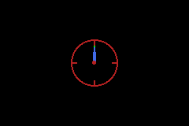

# Timers

The GBA has four hardware timers (0-3). Each is a 16-bit counter that increments at a configurable rate and can trigger an interrupt on overflow. Timers can cascade - timer N+1 increments when timer N overflows - enabling periods far longer than a single 16-bit counter allows.

## Compile-time timer configuration

stdgba configures timers at compile time using `std::chrono` durations. The compiler selects the best prescaler and cascade chain automatically:

```cpp
#include <gba/timer>
#include <gba/peripherals>
#include <algorithm>

using namespace std::chrono_literals;

// A 1-second timer with overflow IRQ
constexpr auto timer_1s = gba::compile_timer(1s, true);

// Write the cascade chain to hardware starting at timer 0
std::copy(timer_1s.begin(), timer_1s.end(), gba::reg_tmcnt.begin());
```

`compile_timer` returns a `std::array` of timer register values. A simple duration might need only one timer; a long duration might cascade two or three. The array size is determined at compile time.

You can also start timers at a specific index:

```cpp
// Use timers 2 and 3 for a long-duration timer
constexpr auto timer_10s = gba::compile_timer(10s, false);  // No IRQ
std::copy(timer_10s.begin(), timer_10s.end(), gba::reg_tmcnt.begin() + 2);
```

And disable timers by clearing their control registers:

```cpp
// Disable timer 0
gba::reg_tmcnt_h[0] = {};
```

### Supported durations

Any `std::chrono::duration` works:

```cpp
#include <gba/timer>
#include <gba/peripherals>
#include <algorithm>

using namespace std::chrono_literals;

constexpr auto fast = gba::compile_timer(16ms);
constexpr auto slow = gba::compile_timer(30s, true);
constexpr auto precise = gba::compile_timer(100us);

// All three can be loaded without conflicts (each uses different timer indices)
std::copy(fast.begin(), fast.end(), gba::reg_tmcnt.begin() + 0);    // Timers 0+
std::copy(slow.begin(), slow.end(), gba::reg_tmcnt.begin() + 1);    // Timers 1+
std::copy(precise.begin(), precise.end(), gba::reg_tmcnt.begin() + 2);  // Timers 2+
```

If the duration cannot be represented exactly, `compile_timer` picks the closest possible configuration. Use `compile_timer_exact` if you need an exact match (compile error if impossible).

## Raw timer registers

For manual control, write directly to the timer registers:

```cpp
#include <gba/peripherals>

// Timer 0: 1024-cycle prescaler, enable interrupt
gba::reg_tmcnt_l[0] = 0;                                      // Reload value (auto-reload on overflow)
gba::reg_tmcnt_h[0] = {
    .cycles = gba::cycles_1024,
    .overflow_irq = true,
    .enabled = true
};

// Timer 1: cascade from timer 0 (counts overflows)
gba::reg_tmcnt_l[1] = 0;
gba::reg_tmcnt_h[1] = {
    .cascade = true,
    .overflow_irq = true,
    .enabled = true
};
```

## Polling timer state

Read the current timer counter (careful: this captures the live counter value):

```cpp
// Get current count of timer 0
unsigned short count = gba::reg_tmcnt_l_stat[0];

// Check if timer 2 is running
bool timer2_enabled = (gba::reg_tmcnt_h[2].enabled);
```

Note: `reg_tmcnt_l_stat` is a read-only view of the counter registers. The count continuously increments and should be read only when you need the current value.

## Prescaler values

| Value | Divider | Frequency |
|-------|---------|-----------|
| 0 | 1 | 16.78 MHz |
| 1 | 64 | 262.2 kHz |
| 2 | 256 | 65.5 kHz |
| 3 | 1024 | 16.4 kHz |

## tonclib comparison

| stdgba | tonclib |
|--------|---------|
| `compile_timer(1s)` | Manual prescaler + reload calculation |
| `gba::reg_tmcnt_h[0] = { ... };` | `REG_TM0CNT = TM_FREQ_1024 \| TM_ENABLE;` |
| Automatic cascade chain | Manual multi-timer setup |

## Demo: Analogue Clock with Timer

This demo combines compile-time timer setup, timer IRQ handling, shapes-generated OBJ sprites, and BIOS affine transforms for clock-hand rotation:

```cpp
{{#include ../../demos/demo_timer_clock.cpp:8:}}
```



Key points shown in the demo:

- `compile_timer(1s, true)` configures a 1-second overflow interrupt at compile time.
- The timer IRQ increments a seconds counter used for hand angles.
- `ObjAffineSet(...)` writes affine matrices each frame to rotate hour/minute/second hands.
- Angle literals are used directly in runtime math (`30_deg * hours + 0.5_deg * mins`).
