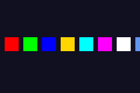

# Colours & Palettes

The GBA uses 16-bit colours: 5 bits each for red, green, and blue in bits 0-14.

`"..."_clr` lives in `gba::literals` and accepts both hex (`"#RRGGBB"`) and CSS web colour names (for example `"cornflowerblue"`).

Named-colour list: [MDN CSS named colors](https://developer.mozilla.org/en-US/docs/Web/CSS/named-color).

## Colour format

```text
Bit:  15      14-10  9-5    4-0
      grn_lo  Blue   Green  Red
```

Most software treats bit 15 as unused and works with 15-bit colour (5-5-5). This is perfectly fine for general use.

```cpp
#include <gba/video>

// Write colours to background palette
gba::pal_bg_mem[0] = { .red = 0 };                  // Black (background colour)
gba::pal_bg_mem[1] = { .red = 31 };                  // Red   (5 bits max = 31)
gba::pal_bg_mem[2] = { .green = 31 };                // Green (5-bit, range 0-31)
gba::pal_bg_mem[3] = { .blue = 31 };                 // Blue
gba::pal_bg_mem[4] = { .red = 31, .green = 31, .blue = 31 }; // White

// Hex colour literals (grn_lo is derived from the green channel)
using namespace gba::literals;
gba::pal_bg_mem[5] = "#FF8040"_clr;
gba::pal_bg_mem[6] = "cornflowerblue"_clr;
```

Here are several colours displayed as palette swatches using Mode 0 tiles:



```cpp
{{#include ../../demos/demo_colors.cpp:7:}}
```

## Palette memory layout

The GBA has 512 palette entries total (1 KB), split evenly:

| Region        | Address      | Entries | Used by           |
|---------------|--------------|---------|-------------------|
| `mem_pal_bg`  | `0x05000000` | 256     | Background tiles  |
| `mem_pal_obj` | `0x05000200` | 256     | Sprites (objects) |

In 4bpp (16-colour) mode, the 256 entries are organised as 16 sub-palettes of 16 colours each. Each tile chooses which sub-palette to use.

In 8bpp (256-colour) mode, all 256 entries form one large palette.

## Palette index 0

Palette index 0 is special: it is the **transparent colour** for both backgrounds and sprites. For the very first background palette (sub-palette 0, index 0), it also serves as the screen backdrop colour - the colour you see when no background or sprite covers a pixel.

```cpp
// Set the backdrop to dark blue
gba::pal_bg_mem[0] = { .blue = 16 };
```

## Bit 15 and hardware blending

Bit 15 (`grn_lo`) is usually safe to ignore for everyday palette work.

When colour effects are enabled (brighten, darken, or alpha blend), hardware treats green as an internal 6-bit value and may use `grn_lo`. This can create hardware-visible differences that many emulators do not reproduce.

For full details, demo code, and emulator-vs-hardware screenshots, see [Advanced: Green Low Bit (`grn_lo`)](../advanced/green-low-bit.md).

## tonclib comparison

### Colour construction

| stdgba                                | tonclib          | Notes                  |
|---------------------------------------|------------------|------------------------|
| `{ .red = r, .green = g, .blue = b }` | `RGB15(r, g, b)` | 5-bit channels (0-31)  |
| `"#RRGGBB"_clr`                       | `RGB8(r, g, b)`  | 8-bit channels (0-255) |

`RGB8` and `"#RRGGBB"_clr` are direct equivalents - both accept 8-bit per channel values and truncate to 5 bits.

### Named colour constants

tonclib defines a small set of `CLR_*` constants for the primary colours. The stdgba equivalents use CSS web colour names with `_clr`:

<table>
  <thead>
    <tr>
      <th>tonclib</th>
      <th>stdgba</th>
      <th>Value</th>
    </tr>
  </thead>
  <tbody>
    <tr><td><code>CLR_BLACK</code></td><td><code>"black"_clr</code></td><td bgcolor="#000000"><code>#000000</code></td></tr>
    <tr><td><code>CLR_RED</code></td><td><code>"red"_clr</code></td><td bgcolor="#FF0000"><code>#FF0000</code></td></tr>
    <tr><td><code>CLR_LIME</code></td><td><code>"lime"_clr</code></td><td bgcolor="#00FF00"><code>#00FF00</code></td></tr>
    <tr><td><code>CLR_YELLOW</code></td><td><code>"yellow"_clr</code></td><td bgcolor="#FFFF00"><code>#FFFF00</code></td></tr>
    <tr><td><code>CLR_BLUE</code></td><td><code>"blue"_clr</code></td><td bgcolor="#0000FF"><code>#0000FF</code></td></tr>
    <tr><td><code>CLR_MAG</code></td><td><code>"magenta"_clr</code> or <code>"fuchsia"_clr</code></td><td bgcolor="#FF00FF"><code>#FF00FF</code></td></tr>
    <tr><td><code>CLR_CYAN</code></td><td><code>"cyan"_clr</code> or <code>"aqua"_clr</code></td><td bgcolor="#00FFFF"><code>#00FFFF</code></td></tr>
    <tr><td><code>CLR_WHITE</code></td><td><code>"white"_clr</code></td><td bgcolor="#FFFFFF"><code>#FFFFFF</code></td></tr>
    <tr><td><code>CLR_MAROON</code></td><td><code>"maroon"_clr</code></td><td bgcolor="#800000"><code>#800000</code></td></tr>
    <tr><td><code>CLR_GREEN</code></td><td><code>"green"_clr</code></td><td bgcolor="#008000"><code>#008000</code></td></tr>
    <tr><td><code>CLR_NAVY</code></td><td><code>"navy"_clr</code></td><td bgcolor="#000080"><code>#000080</code></td></tr>
    <tr><td><code>CLR_TEAL</code></td><td><code>"teal"_clr</code></td><td bgcolor="#008080"><code>#008080</code></td></tr>
    <tr><td><code>CLR_PURPLE</code></td><td><code>"purple"_clr</code></td><td bgcolor="#800080"><code>#800080</code></td></tr>
    <tr><td><code>CLR_OLIVE</code></td><td><code>"olive"_clr</code></td><td bgcolor="#808000"><code>#808000</code></td></tr>
    <tr><td><code>CLR_ORANGE</code></td><td><code>"orange"_clr</code></td><td bgcolor="#FFA500"><code>#FFA500</code></td></tr>
    <tr><td><code>CLR_GRAY</code> / <code>CLR_GREY</code></td><td><code>"gray"_clr</code> or <code>"grey"_clr</code></td><td bgcolor="#808080"><code>#808080</code></td></tr>
    <tr><td><code>CLR_SILVER</code></td><td><code>"silver"_clr</code></td><td bgcolor="#C0C0C0"><code>#C0C0C0</code></td></tr>
  </tbody>
</table>

stdgba's CSS colour set is a strict superset - all 147 CSS Color Level 4 names are supported, including colours like `"cornflowerblue"_clr` that have no tonclib constant.
