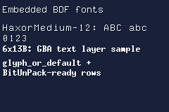

# Embedding Fonts (BDF)

stdgba embeds bitmap fonts at compile time from BDF files through `gba::embed::bdf` in `<gba/embed>`.

BDF format reference: [Glyph Bitmap Distribution Format (Wikipedia)](https://en.wikipedia.org/wiki/Glyph_Bitmap_Distribution_Format).

This gives you a typed font object with:

- per-glyph metrics and offsets,
- packed 1bpp glyph bitmap data,
- helpers for BIOS `BitUnPack` parameters,
- lookup with fallback to `DEFAULT_CHAR`.

## Quick start

```cpp
#include <array>
#include <gba/embed>

static constexpr auto font = gba::embed::bdf([] {
    return std::to_array<unsigned char>({
#embed "9x18.bdf"
    });
});

static_assert(font.glyph_count > 0);
```

The returned type is `gba::embed::bdf_font_result<GlyphCount, BitmapBytes>`.

## Demo

The demo below embeds multiple BDF files and renders them in one text layer.

Demo fonts used:

- `6x13B.bdf`
- `HaxorMedium-12.bdf`

Font source: [IT-Studio-Rech/bdf-fonts](https://github.com/IT-Studio-Rech/bdf-fonts).

The demo applies `with_shadow<1, 1>` to both embedded fonts and uses the
`two_plane_three_color` profile so the shadow pass is visible.

```cpp
{{#include ../../demos/demo_embed_fonts.cpp:4:}}
```



## What `embed::bdf(...)` parses

The parser expects standard text BDF structure and reads these fields:

- font-level:
  - `FONTBOUNDINGBOX`
  - `CHARS`
  - `FONT_ASCENT` and `FONT_DESCENT` (from `STARTPROPERTIES` block)
  - `DEFAULT_CHAR` (optional, from `STARTPROPERTIES`)
- per-glyph:
  - `STARTCHAR` / `ENDCHAR`
  - `ENCODING`
  - `DWIDTH`
  - `BBX`
  - `BITMAP`

It validates glyph counts and bitmap row sizes at compile time.

## BDF to GBA bitmap packing

Each `BITMAP` row is packed to 1bpp bytes in a BIOS-friendly way:

- leftmost source pixel is written to bit 0 (LSB),
- rows are stored in row-major order,
- byte width is `(glyph_width + 7) / 8`.

This layout is designed so `BitUnPack` can expand glyph rows directly.

## Using glyph metadata

```cpp
const auto& g = font.glyph_or_default(static_cast<unsigned int>('A'));

auto width_px = g.width;
auto height_px = g.height;
auto advance_px = g.dwidth;
```

Useful members on `glyph`:

- `encoding`
- `dwidth`
- `width`, `height`
- `x_offset`, `y_offset`
- `bitmap_offset`
- `bitmap_byte_width`
- `bitmap_bytes()`

## Accessing bitmap data and BitUnPack headers

```cpp
#include <gba/bios>

const auto& g = font.glyph_or_default(static_cast<unsigned int>('A'));
const unsigned char* src = font.bitmap_data(g);

auto unpack = g.bitunpack_header(
    /*dst_bpp=*/4,
    /*dst_ofs=*/1,
    /*offset_zero=*/false
);

// Example destination buffer for expanded glyph data
unsigned int expanded[128]{};

gba::BitUnPack(src, expanded, unpack);
```

You can also fetch by encoding directly:

```cpp
const unsigned char* src = font.bitmap_data(static_cast<unsigned int>('A'));
auto unpack = font.bitunpack_header(static_cast<unsigned int>('A'));
```

## Fallback behaviour

`glyph_or_default(encoding)` resolves in this order:

1. exact glyph encoding,
2. `DEFAULT_CHAR` (if present and found),
3. glyph index `0`.

This makes rendering robust when text includes characters not present in your BDF.

## Font variants for text rendering

After embedding, you can generate compile-time variants for the text renderer:

```cpp
#include <gba/text>

static constexpr auto font_shadow = gba::text::with_shadow<1, 1>(font);
static constexpr auto font_outline = gba::text::with_outline<1>(font);
```

These variants keep the same font-style API but add pre-baked decoration masks.

## See also

- [Text Rendering](./text-rendering.md)
- [Embedding Images](./embed.md)
