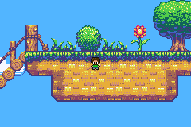

# Embedding Images

The `<gba/embed>` header converts image files into GBA-ready data entirely at compile time. Combined with C23's `#embed` directive, this replaces external asset pipelines like grit with a single `#include` and a constexpr variable.

For procedural sprite generation without source image files, see [Shapes](../utilities/shapes.md).
For animated sprite-sheet workflows, see [Animated Sprite Sheets](./embed-animated.md).
For type-level API details, see [Embedded Sprite Type Reference](../reference/embed-sprite.md).

This page focuses on still images: framebuffers, tilemaps, and single-frame sprites.

## Supported formats

| Format   | Variants                                                                  | Transparency |
|----------|---------------------------------------------------------------------------|--------------|
| **PPM**  | 24-bit RGB                                                                | Index 0      |
| **PNG**  | Grayscale, RGB, indexed, grayscale+alpha, RGBA (8-bit channels)           | Alpha < 50%  |
| **TGA**  | Uncompressed, RLE, true-colour (15/16/24/32bpp), colour-mapped, grayscale | Alpha < 50%  |

Format is auto-detected from the file header.

## Conversion functions

| Function | Output | Best for |
|----------|--------|----------|
| `bitmap15` | Flat `gba::color` array | Mode 3 or software blitters |
| `indexed4` | 4bpp sprite payload + 16-colour palette + tilemap | Backgrounds and 4bpp sprites |
| `indexed8` | 8bpp tiles + 256-colour palette + tilemap | 8bpp backgrounds |
| `indexed4_sheet<FrameW, FrameH>` | `sheet4_result` | Animated OBJ sheets; covered on the next page |

All converters take a supplier lambda returning `std::array<unsigned char, N>`.

## Quick start

```cpp
#include <gba/embed>

static constexpr auto bg = gba::embed::indexed4([] {
    return std::to_array<unsigned char>({
#embed "background.png"
    });
});

static constexpr auto hero = gba::embed::indexed4<gba::embed::dedup::none>([] {
    return std::to_array<unsigned char>({
#embed "hero.png"
    });
});
```

Use `dedup::none` for OBJ sprites so tiles stay in 1D sequential order. Use the default `dedup::flip` for backgrounds to save VRAM when tiles repeat.

## Example: scrollable background with sprite

This demo embeds a 512x256 background image and a 16x16 character sprite, both as PNG files. The D-pad scrolls the background, and holding A + D-pad moves the sprite:

```cpp
{{#include ../../demos/demo_embed_sprite.cpp:4:}}
```



### How it works

The background uses a 2x1 screenblock layout (`size = 1` in `reg_bgcnt`), giving 64x32 tiles (512x256 pixels). The `indexed4` map is stored in GBA screenblock order, so the entire map can be written to VRAM with one `std::memcpy`.

The sprite uses `dedup::none` so its tiles remain sequential - exactly what the GBA expects for 1D OBJ mapping. Without this, deduplication could merge mirrored tiles and break the sprite layout.

Transparent pixels (alpha < 128 in the PNG source) become palette index 0, so the hardware automatically shows the background through the sprite.

## Tile deduplication

The `indexed4` and `indexed8` converters accept a `dedup` mode as a template parameter:

| Mode | Behaviour | Use case |
|------|----------|----------|
| `dedup::flip` (default) | Matches identity, horizontal flip, vertical flip, and both | Background tilemaps |
| `dedup::identity` | Matches exact duplicates only | Tilemaps without flip support |
| `dedup::none` | No deduplication; tiles stay sequential | OBJ sprites |

```cpp
using gba::embed::dedup;

constexpr auto bg = gba::embed::indexed4(supplier);
constexpr auto obj = gba::embed::indexed4<dedup::none>(supplier);
```

When `dedup::flip` is active, matching tiles reuse an existing tile index and encode flip flags in the emitted `screen_entry`. This keeps map VRAM usage low for symmetric art.

## Sprite OAM helpers

When image dimensions match a valid GBA sprite size, `indexed4` returns a `sprite` payload with `obj()` and `obj_aff()` helpers:

```cpp
constexpr auto sprite = gba::embed::indexed4<gba::embed::dedup::none>([] {
    return std::to_array<unsigned char>({
#embed "sprite.png"
    });
});

gba::obj_mem[0] = sprite.sprite.obj(0);
gba::obj_aff_mem[0] = sprite.sprite.obj_aff(0);
```

Valid sprite sizes:

| Shape | Sizes |
|-------|-------|
| Square | 8x8, 16x16, 32x32, 64x64 |
| Wide | 16x8, 32x8, 32x16, 64x32 |
| Tall | 8x16, 8x32, 16x32, 32x64 |

If the source image does not match one of those shapes, `obj()` and `obj_aff()` fail at compile time.

## Transparency and palettes

- **PPM**: palette index 0 is always reserved as transparent; the first visible colour becomes index 1.
- **PNG**: RGBA/GA alpha maps transparent pixels (alpha < 128) to palette index 0.
- **TGA**: 32bpp alpha and 16bpp attribute-bit transparency map transparent pixels (alpha < 128) to palette index 0.
- **indexed4**: images may spread across multiple palette banks when background tiles use <= 15 opaque colours per tile.
- **indexed8**: one 256-entry palette is shared across the whole image.

## Constexpr evaluation limits

All image conversion happens at compile time. Large assets can hit GCC's constexpr operation limit. If you see `constexpr evaluation operation count exceeds limit`, raise the limit for that target:

```cmake
target_compile_options(my_target PRIVATE -fconstexpr-ops-limit=335544320)
```

Small sprites usually fit within default limits. Large backgrounds, especially 512x256 maps, often need a higher ceiling.
