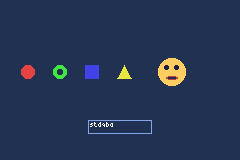

# Shapes

stdgba provides a consteval API for generating sprite pixel data from geometric shapes. All pixel data is computed at compile time and stored directly in ROM.

For file-based asset pipelines, see [Advanced: Embedding Images](../advanced/embed.md).

## Quick start

```cpp
#include <gba/shapes>
using namespace gba::shapes;

// Define 16x16 sprite geometry
constexpr auto sprite = sprite_16x16(
    circle(8.0, 8.0, 4.0),   // palette index 1
    rect(2, 2, 12, 12)        // palette index 2
);

// Load colors into palette memory
gba::pal_obj_bank[0][1] = { .red = 31 };    // red circle
gba::pal_obj_bank[0][2] = { .green = 31 };  // green rectangle

// Copy pixel data to VRAM
auto* dest = gba::memory_map(gba::mem_vram_obj);
std::memcpy(dest, sprite.data(), sprite.size());

// Set OAM attributes
gba::obj_mem[0] = sprite.obj(gba::tile_index(dest));
```

## How it works

Each `sprite_WxH()` call takes a list of shape groups. Each group is assigned a sequential palette index starting from 1 (palette index 0 is transparent). The shapes within each group are rasterized into 4bpp pixel data.

## Available sprite sizes

| Size | Function | Bytes |
|------|----------|-------|
| 8x8 | `sprite_8x8()` | 32 |
| 16x16 | `sprite_16x16()` | 128 |
| 16x32 | `sprite_16x32()` | 256 |
| 32x16 | `sprite_32x16()` | 256 |
| 32x32 | `sprite_32x32()` | 512 |
| 32x64 | `sprite_32x64()` | 1024 |
| 64x32 | `sprite_64x32()` | 1024 |
| 64x64 | `sprite_64x64()` | 2048 |

## Shape types

| Shape | Signature | Notes |
|-------|-----------|-------|
| Circle | `circle(cx, cy, r)` | Float center + radius for pixel alignment |
| Oval | `oval(x, y, w, h)` | Bounding box coordinates |
| Rectangle | `rect(x, y, w, h)` | Bounding box coordinates |
| Triangle | `triangle(x1, y1, x2, y2, x3, y3)` | Three vertices |
| Line | `line(x1, y1, x2, y2, thickness)` | Endpoints + thickness |
| Circle Outline | `circle_outline(cx, cy, r, thickness)` | Hollow circle |
| Oval Outline | `oval_outline(x, y, w, h, thickness)` | Hollow oval |
| Rect Outline | `rect_outline(x, y, w, h, thickness)` | Hollow rectangle |
| Text | `text(x, y, "string")` | Built-in 3x5 font |

## Circle pixel alignment

The float center and radius control how circles align to the pixel grid:

```cpp
circle(8.0, 8.0, 4.0)   // 8px even diameter, center between pixels
circle(8.0, 8.0, 3.5)   // 7px odd diameter, center on pixel 8
oval(4, 4, 8, 8)         // Same 8px circle via bounding box
```

## Erasing with palette index 0

Palette index 0 is transparent. Switch to it to cut holes in shapes:

```cpp
constexpr auto donut = sprite_16x16(
    circle(8.0, 8.0, 6.0),     // Filled circle (palette 1)
    palette_idx(0),              // Switch to transparent
    circle(8.0, 8.0, 3.0)       // Erase inner circle
);
```

## Grouping shapes

Use `group()` to assign multiple shapes to the same palette index:

```cpp
constexpr auto sprite = sprite_16x16(
    group(circle(8.0, 8.0, 3.0), line(0, 0, 16, 16, 1)),  // Both palette 1
    group(rect(0, 0, 16, 16))                               // Palette 2
);
```

## OAM attributes

Each sprite result provides a pre-filled `obj` method that sets the correct shape, size, and color depth for OAM:

```cpp
auto obj_attrs = sprite.obj(gba::tile_index(dest));
obj_attrs.x = 120;
obj_attrs.y = 80;
gba::obj_mem[0] = obj_attrs;
```

## Example output

Several consteval shapes rendered as sprites:

```cpp
{{#include ../../demos/demo_shapes.cpp:6:}}
```


