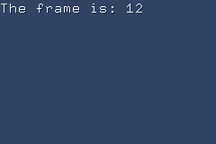

# Text Rendering

stdgba provides a text renderer targeting 4bpp BG tile modes.

The core goal is to render formatted strings efficiently - including typewriter effects - without
a full-screen redraw each frame.

## Features

- Bitmap fonts embedded from BDF files at compile time via `<gba/embed>`.
- Compile-time font variant baking: `with_shadow<dx, dy>` and `with_outline<thickness>`.
- Character streams:
  - C-string streams (`cstr_stream`).
  - Format generator streams from `<gba/format>` (`format_stream`).
- Word wrapping using a lookahead to the next break character.
- Incremental rendering with `draw_cursor` and `next_visible()` for typewriter effects.
- Bitplane palette profiles for 2-colour, 3-colour, and full-colour (up to 15 colours) text.
- Inline colour escape sequences for per-character palette switching in full-colour mode.

## Quick start

The demo below embeds `9x18.bdf`, configures the bitplane palette, and draws one visible glyph per frame.

```cpp
{{#include ../../demos/demo_text_render.cpp:4:}}
```



---

## Bitplane profiles

The renderer multiplexes multiple palette layers onto 4bpp VRAM tiles using a mixed-radix
encoding scheme.  Choose the profile that matches how many colour roles your text needs.

| Profile | Planes | Palette entries | Colour roles |
|---------|--------|-----------------|--------------|
| `two_plane_binary` | 2 | 4 | background, foreground |
| `two_plane_three_color` | 2 | 9 | background, foreground, shadow |
| `three_plane_binary` | 3 | 8 | background, foreground |
| `one_plane_full_color` | 1 | 16 | nibble = palette index directly |

`two_plane_three_color` is the most common choice: it provides foreground, shadow (or
outline decoration), and background using only two VRAM tiles worth of palette space
per 8x8 cell.

`one_plane_full_color` maps nibble values directly to palette entries, giving up to 15
distinct colours at the cost of one VRAM tile per cell (no cell sharing).

---

## Palette configuration

A `bitplane_config` binds a profile to concrete palette banks and a starting index:

```cpp
constexpr auto config = gba::text::bitplane_config{
    .profile    = gba::text::bitplane_profile::two_plane_three_color,
    .palbank_0  = 1,   // plane 0 uses palette bank 1
    .palbank_1  = 2,   // plane 1 uses palette bank 2
    .start_index = 1,  // first occupied entry within each bank
};
```

Use `checked_bitplane_config` if you want invalid configurations to become compile errors.

Apply colours to palette RAM with `set_theme`:

```cpp
gba::text::set_theme(config, {
    .background = "#304060"_clr,
    .foreground = "white"_clr,
    .shadow     = "#102040"_clr,
});
```

`set_theme` fills all active planes in one call.  Call it again any time to change the
entire colour scheme without re-rendering text.

---

## Font variants

Font variants bake visual effects into the glyph bitmap data at compile time.
The renderer then uses a separate decoration bitmap for the shadow/outline colour role,
so no extra work is done at runtime.

### Drop shadow

```cpp
// 1px shadow shifted right and down
static constexpr auto font_shadowed = gba::text::with_shadow<1, 1>(base_font);
```

The template arguments are `<ShadowDX, ShadowDY>`.  The shadow pixels are only drawn where
they do not overlap the foreground glyph, so they never occlude text.

### Outline

```cpp
// 1px outline around every glyph
static constexpr auto font_outlined = gba::text::with_outline<1>(base_font);
```

The template argument is `<OutlineThickness>`.  Each glyph is expanded by `thickness`
pixels in every direction; the outline pixels form a separate decoration mask that is
drawn in the shadow colour role.

Both variants return a new font type compatible with all drawing functions - pass them
wherever a plain font is accepted.

---

## Streams

A stream wraps a text source and exposes single-character iteration plus a lookahead
used by the word-wrap algorithm.

### C-string stream

```cpp
gba::text::stream_metrics metrics{.letter_spacing_px = 1};
auto s = gba::text::stream("HP: 42/99", font, metrics);
```

### Format generator stream

```cpp
static constexpr auto fmt = "HP: {hp}/{max}"_fmt;

auto gen = fmt.generator("hp"_arg = hp, "max"_arg = max_hp);
auto s   = gba::text::stream(gen, font, metrics);
```

The generator is copied for lookahead, so it must be copyable (all format generators are).

### Inline colour escapes

In `one_plane_full_color` mode, embed palette switches directly in the text using
the literal escape sequence `\x1B` followed by a hex digit (0-F).

```cpp
// Hex digit = palette nibble: 0-9 = nibbles 0-9, A-F = nibbles 10-15
std::string msg = "Status: \x1B2Error\x1B3 - \x1B1OK";
//                         ^^         ^^       ^^
//                         red        yellow   white
```

The escape code is consumed silently; it never appears as text and does not affect glyph
counts or word-wrap measurements.  The active nibble resets to `1` (foreground) at the
start of each `draw_stream` or cursor call.

See [Full-colour mode](#full-colour-mode) for how to configure the palette and the layer
to use `one_plane_full_color`.

---

## Drawing

### `draw_stream` - batch rendering

Renders a full stream in one call, with layout, word wrapping, and optional character
limit for partial reveals:

```cpp
gba::text::draw_metrics draw_cfg{
    .letter_spacing_px = 1,
    .line_spacing_px   = 2,
    .wrap_width_px     = 220,
    .break_chars       = gba::text::break_policy::whitespace,
};

// Draw everything
auto count = layer.draw_stream(font, s, /*x=*/8, /*y=*/16, draw_cfg);

// Draw only the first 10 characters (typewriter snapshot)
auto count = layer.draw_stream(font, s, 8, 16, draw_cfg, /*max_chars=*/10);
```

Returns the number of characters emitted (including whitespace and control codes).

### `draw_char` - single glyph

```cpp
// Returns the advance width in pixels
auto advance = layer.draw_char(font, static_cast<unsigned int>('A'), pen_x, baseline_y);
```

### `draw_cursor` - incremental typewriter

`draw_cursor` draws one character per `next()` call, maintaining cursor position between
calls.  Use `next_visible()` to skip whitespace and advance the cursor in the same call,
so a typewriter effect never wastes a frame on a space:

```cpp
auto cursor = layer.make_cursor(font, s, /*start_x=*/0, /*start_y=*/0, draw_cfg);

// In the update loop - one visible glyph per frame:
if (!cursor.next_visible()) {
    // stream exhausted - restart or do something else
}
```

The cursor also exposes:

| Method | Description |
|--------|-------------|
| `next()` | Draw the next character; returns `true` while characters remain |
| `next_visible()` | Draw the next non-whitespace character; skips layout whitespace in one call |
| `emitted()` | Total characters processed so far |
| `done()` | `true` when the stream is exhausted |
| `operator()()` | Shorthand for `next()` |

To restart a typewriter sequence, re-create the layer (to clear tile state) and construct
a fresh cursor:

```cpp
// Reset tile allocator and layer, then create a new cursor
alloc  = {.next_tile = 1, .end_tile = 512};
layer  = gba::text::bg4_text_layer{31, config, alloc};
cursor = layer.make_cursor(font, new_stream, 0, 0, draw_cfg);
```

---

## Full-colour mode

`one_plane_full_color` maps nibble values directly to palette entries, giving access to
up to 15 distinct foreground colours in a single text layer.

```cpp
constexpr auto config = gba::text::bitplane_config{
    .profile    = gba::text::bitplane_profile::one_plane_full_color,
    .palbank_0  = 3,
    .start_index = 0,   // must be 0 so nibble 0 = transparent
};
```

### Inline colour escapes

Use `color_escape(nibble)` to change the active foreground palette entry mid-string
(see [Streams -- Inline colour escapes](#inline-colour-escapes) above for usage).
The nibble argument must be in the range `[1, 15]`; `0` is reserved for transparent.

Make sure the corresponding palette entries are populated.  `set_theme` fills nibbles
1 (foreground) and 2 (shadow); write additional entries directly:

```cpp
gba::text::set_theme(config, {
    .background = {},             // nibble 0 = transparent
    .foreground = "white"_clr,   // nibble 1
    .shadow     = "#FF4444"_clr, // nibble 2 -- repurposed as accent red
});

// Extra colours beyond the three theme roles
gba::pal_bg_mem[config.palbank_0 * 16 + 3] = "#FFFF00"_clr; // nibble 3 = yellow
gba::pal_bg_mem[config.palbank_0 * 16 + 4] = "#88FF88"_clr; // nibble 4 = green
```

---

## API reference

### `bitplane_config`

| Field | Type | Description |
|-------|------|-------------|
| `profile` | `bitplane_profile` | Plane/colour role layout |
| `palbank_0` | `unsigned char` | Palette bank for plane 0 (255 = unused) |
| `palbank_1` | `unsigned char` | Palette bank for plane 1 (255 = unused) |
| `palbank_2` | `unsigned char` | Palette bank for plane 2 (255 = unused) |
| `start_index` | `unsigned char` | First occupied entry within each bank |

### `draw_metrics`

| Field | Default | Description |
|-------|---------|-------------|
| `letter_spacing_px` | 0 | Extra pixels between glyphs |
| `line_spacing_px` | 0 | Extra pixels between lines |
| `wrap_width_px` | 240 | Maximum line width before wrapping |
| `break_chars` | `whitespace` | Where line breaks are allowed |

`break_policy::whitespace_and_hyphen` also allows breaking after hyphens.

### `stream_metrics`

| Field | Default | Description |
|-------|---------|-------------|
| `letter_spacing_px` | 0 | Extra pixels between glyphs (used for lookahead width) |
| `tab_width_px` | 16 | Width of a tab character in pixels |
| `break_chars` | `whitespace` | Break policy for lookahead |

### `linear_tile_allocator`

Simple bump allocator over a VRAM tile range.  Reset it by re-assigning the struct:

```cpp
alloc = {.next_tile = 1, .end_tile = 512};
```

### `bg4_text_layer<WidthTiles, HeightTiles, Allocator>`

| Method | Description |
|--------|-------------|
| `draw_char(font, encoding, x, y)` | Draw a single glyph; returns advance width |
| `draw_stream(font, s, x, y, metrics [, max])` | Draw a full stream with layout |
| `make_cursor(font, s, x, y, metrics)` | Create an incremental `draw_cursor` |
| `clear()` | Reset all tile allocations and clear the tilemap to background |
| `uses_full_color()` | `true` when the profile is `one_plane_full_color` |

---

## Notes

- Word wrapping only occurs at word starts (after a break character).  Long tokens are
  allowed to overflow rather than wrapping one character per line.
- The bitplane renderer uses mixed-radix encoding so multiple planes can share a 4bpp
  tile while selecting different palette banks.
- `start_index = 0` is required when using `one_plane_full_color` so that nibble 0 maps
  to palette index 0 (transparent in 4bpp tile mode).
- `with_shadow` and `with_outline` bake the effect into separate decoration bitmaps at
  compile time; rendering cost is the same as a plain font plus one extra pass per glyph
  for the decoration pixels.
