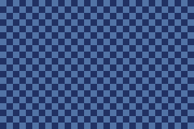

# Tiles & Maps

Tile modes (0-2) are the backbone of GBA graphics. The display hardware composites 8x8 pixel tiles from VRAM, using a *tilemap* to arrange them into backgrounds. This is extremely memory-efficient and the scrolling is handled entirely by hardware.

## How it works

1. **Tile data** (the pixel art) is stored in VRAM "character base blocks"
2. **Tilemap** (which tile goes where) is stored in VRAM "screen base blocks"
3. **Palette** maps pixel indices to colours
4. The hardware reads the map, looks up each tile, applies the palette, and draws the scanline

## Loading tile data

Tile graphics are usually pre-converted at build time and copied into VRAM. Each 8x8 tile in 4bpp mode is 32 bytes (4 bits per pixel, 64 pixels):

```cpp
#include <gba/peripherals>
#include <gba/dma>
#include <gba/video>

// Assuming tile_data is a const array in ROM
extern const unsigned short tile_data[];
extern const unsigned int tile_data_size;

// Copy tile data to character base block 0 (0x06000000)
gba::reg_dma[3] = gba::dma::copy(
    tile_data,
    gba::memory_map(gba::mem_vram_bg),
    tile_data_size / 4
);
```

## Setting up a background

```cpp
// Configure BG0: 256x256, 4bpp tiles
// Character base = 0 (tile data at 0x06000000)
// Screen base = 31 (map at 0x0600F800)
gba::reg_bgcnt[0] = {
    .charblock = 0,
    .screenblock = 31,
    .size = 0,  // 256x256 (32x32 tiles)
};

// Scroll BG0
gba::reg_bgofs[0][0] = 0;
gba::reg_bgofs[0][1] = 0;
```

## Background sizes

| Size value | Dimensions (pixels) | Dimensions (tiles) |
|------------|---------------------|---------------------|
| 0 | 256x256 | 32x32 |
| 1 | 512x256 | 64x32 |
| 2 | 256x512 | 32x64 |
| 3 | 512x512 | 64x64 |

## Scrolling

Scrolling is a single register write per axis:

```cpp
gba::reg_bgofs[0][0] = scroll_x; // BG0 horizontal offset
gba::reg_bgofs[0][1] = scroll_y; // BG0 vertical offset
```

The hardware wraps seamlessly at the background boundaries. A 256x256 background scrolled past x=255 wraps back to x=0 - perfect for side-scrolling games.

Here is a scrollable checkerboard built from two solid tiles:

```cpp
{{#include ../../demos/demo_tiles.cpp:7:}}
```


