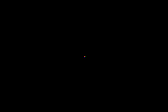

# Video Modes

The GBA has 6 video modes (0-5), split into two categories:

- **Tile modes (0-2)** - the display is built from 8x8 pixel tiles arranged on background layers
- **Bitmap modes (3-5)** - the display is a framebuffer you write pixels to directly

## Setting the video mode

```cpp
#include <gba/peripherals>

// Mode 3: 240x160 bitmap, 15-bit colour, 1 layer
gba::reg_dispcnt = { .video_mode = 3, .enable_bg2 = true };

// Mode 0: 4 tile backgrounds, no rotation
gba::reg_dispcnt = {
    .video_mode = 0,
    .enable_bg0 = true,
    .enable_bg1 = true,
};
```

## Mode summary

| Mode | Type | BG layers | Resolution | Colours |
|------|------|-----------|------------|--------|
| 0 | Tile | BG0-BG3 (all regular) | Up to 512x512 | 4bpp or 8bpp |
| 1 | Tile | BG0-BG1 regular, BG2 affine | Up to 1024x1024 | 4bpp/8bpp + 8bpp |
| 2 | Tile | BG2-BG3 (both affine) | Up to 1024x1024 | 8bpp |
| 3 | Bitmap | BG2 | 240x160 | 15-bit direct |
| 4 | Bitmap | BG2 (page flip) | 240x160 | 8-bit indexed |
| 5 | Bitmap | BG2 (page flip) | 160x128 | 15-bit direct |

## Mode 3: the simplest mode

Mode 3 is a raw 240x160 framebuffer at `0x06000000`. Each pixel is a 15-bit colour:

```cpp
{{#include ../../demos/demo_mode3_pixel.cpp:4:}}
```



This is the easiest mode to learn with, but it uses the most VRAM (75 KB of the available 96 KB), leaving little room for sprites or other data.

## Tile modes for games

Most GBA games use mode 0 or mode 1. Tiles are memory-efficient (a 256x256 background uses only ~2 KB for the map + shared tile data), and the hardware handles scrolling, flipping, and palette lookup in zero CPU time.

See [Tiles & Maps](../graphics/tiles.md) for details on tile-based rendering.
