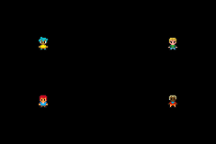

# Multi-Player Link

The GBA Multi-Player serial mode connects two to four systems. Every transfer exchanges one 16-bit word with every
connected system: player 0 is the parent that starts each transfer, and players 1 through 3 are children.

`gba::link_multi` builds a typed message stream over those transfers. A codec defines the value sent by the game, while
stdgba handles framing, escaping, integrity checks, player discovery, and buffering independently for every peer.

## Creating the link

Define the codec at namespace scope, then use it as the first template argument. `Capacity` is the maximum framed
outgoing value and the pending wire-data capacity for each peer.

```cpp
#include <gba/codec>
#include <gba/link>

constexpr auto message_codec = gba::codec::uint8_codec;
constexpr std::size_t link_capacity = 32;

using link_type = gba::link_multi<message_codec, link_capacity>;
auto& link = gba::link.emplace<link_type>(gba::sio_baud_115200);
```

`gba::link` represents the GBA's single serial port. `emplace` replaces the active link, constructs the new type
directly in static storage, and returns a typed reference to it.

All connected systems must use the same codec and baud rate. Available Multi-Player baud rates are `gba::sio_baud_9600`,
`gba::sio_baud_38400`, `gba::sio_baud_57600`, and `gba::sio_baud_115200`.

## Interrupt and polling contract

Enable the serial interrupt and forward it to `link.irq()`:

```cpp
gba::irq_handler = [&link](const gba::irq flags) {
    if (flags.serial) {
        link.irq();
    }
};
gba::reg_ie = {.serial = true};
gba::reg_ime = true;
```

The IRQ handler only captures the completed hardware transfer and stages the next word. Call `poll()` continuously from
your main loop to process completed transfers, update the topology, dispatch errors, and start new rounds:

```cpp
for (;;) {
    link.poll();

    // Update the game and render when needed.
}
```

Do not limit `poll()` to once per video frame. Link throughput and message latency depend on how frequently it runs.

## Sending and receiving

`send()` begins sending one encoded value to every connected peer. It returns `false` if another value is still in
flight or if the framed value exceeds `Capacity`.

```cpp
if (!link.sending()) {
    link.send(local_state);
}
```

Each remote player has an independent receive stream:

```cpp
const auto local_player = link.player();
for (const auto player : gba::multi_players) {
    if (player == local_player) {
        continue;
    }

    while (auto incoming = link.read(player)) {
        apply_remote_state(gba::multi_player_index(player), *incoming);
    }
}
```

`player()` returns the local `gba::multi_player` identifier, `is_parent()` identifies player 0, and `connected()` returns the current
four-player connection mask. A newly configured link initially reports no connected players; topology is learned as
transfer rounds complete.

## Demo: Four-player movement

The demo serialises one `player` value containing position, facing direction, and animation frame. Each GBA controls its
own character and renders the latest state received from every connected peer.

```cpp
{{#include ../../demos/demo_link_multiplay.cpp}}
```



The demo polls throughout active display and the remainder of VBlank, but writes OAM only immediately after
`VBlankIntrWait()`.

## Errors and topology changes

Errors are sticky until explicitly cleared. Query one peer with `errors(player)` or `has_error(player, error)`, and
clear them with `clear_error()` or `clear_errors()`.

```cpp
link.on_error([](const std::size_t player, const gba::link_error error) {
    handle_link_error(player, error);
});
```

The callback runs from `poll()`, never from interrupt context. `gba::link_error::topology_changed` is reported when a
remote player connects, disconnects, or the local player changes. Other errors distinguish receive overflow,
malformed framing, integrity failure, codec failure, and hardware failure.

## See also

- [Normal Link](./normal.md)
- [Link Protocol](./protocol.md)
- [Composing Codecs](../codecs/index.md)
- [`gba::link` Reference](../reference/link.md)
